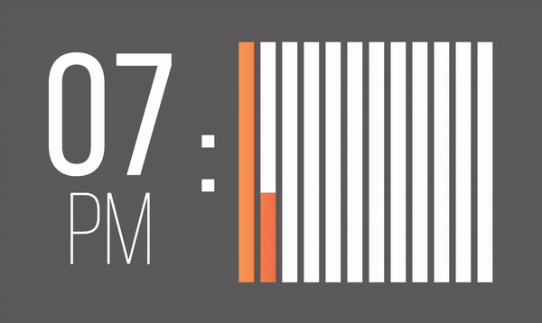
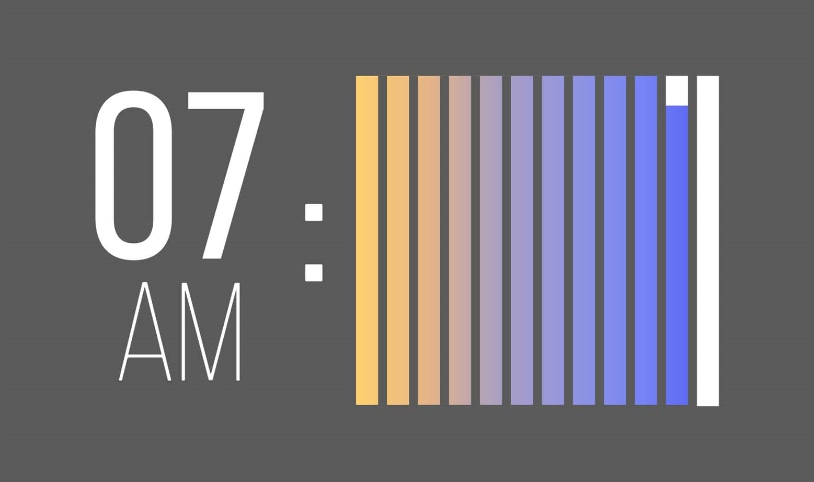
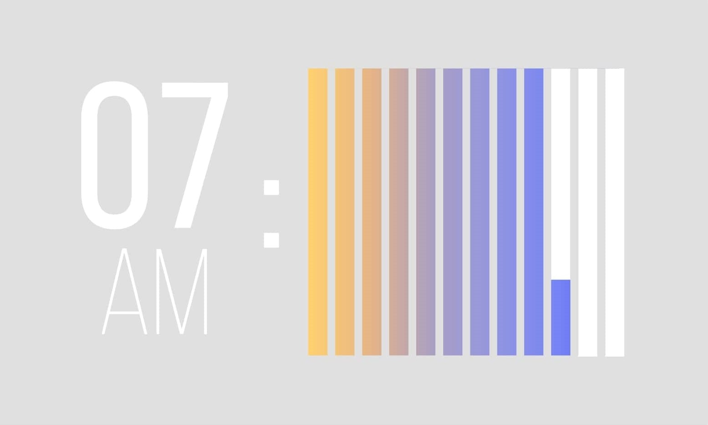
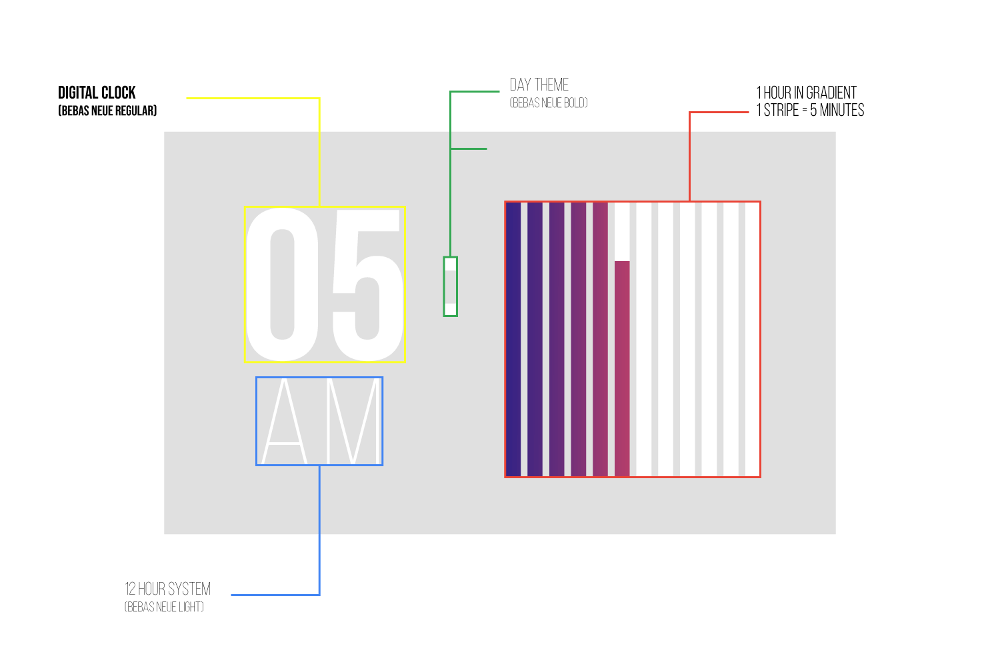
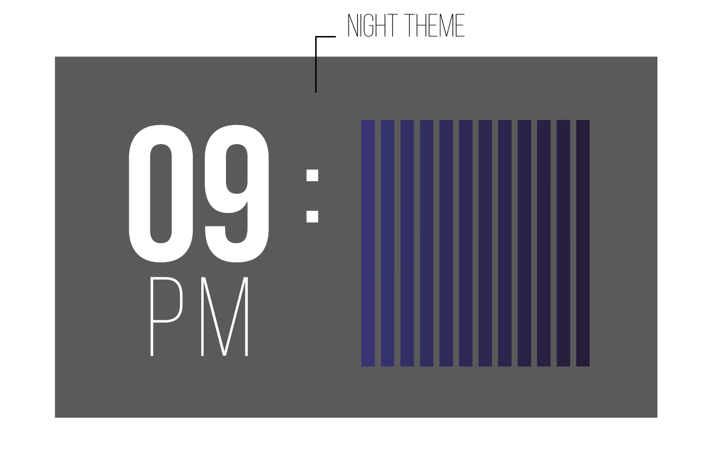
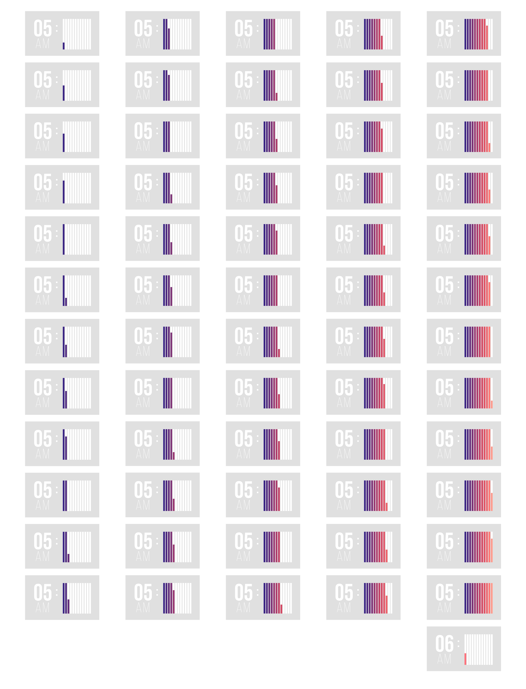
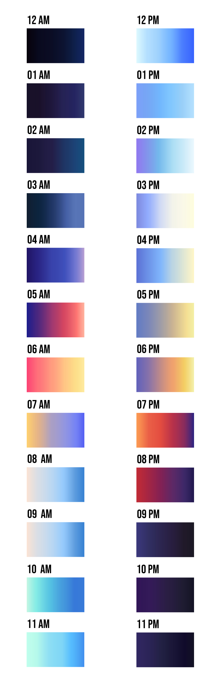

# Gradi Clock
Clock face made for Flutter Clock challenge.

## About

There is an abundant body of research that suggests
that people are sensory creatures  
which relay on daylight and its spectrum  
to effortlessly tell difference between day and night or sunrise and sunset.  
It is a primal instinct, 
created long before days were organized into smaller and smaller sequences. 
 
We present to You the Gradient clock,  
where one part of the clock is a digital number in accordance to the 12-hour system,  
and the second part has an hour spread, shown as series of 12 stripes  
each lasting exactly 5 minutes.  
In addition, stripes combined  
show certain hour as a gradient  
which is reflecting light of the day/night accordingly. 

## Contributors

Design si work of <a href="https://www.linkedin.com/in/katarina-ostoji%C4%87-32819a18a/">Katarina Ostojic</a> and flutter app is made by  <a href="https://www.linkedin.com/in/jankodjuric/">Janko Djuric</a>.

## Preview

 

 

 

Flutter web preview: https://jankolancer.github.io/gradi_clock/

## Design

 

 

 

 

